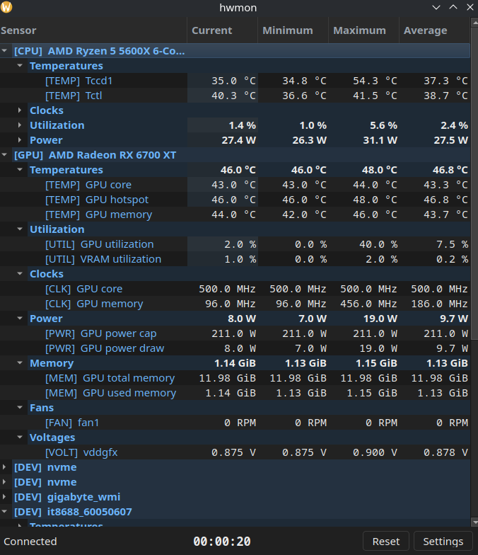
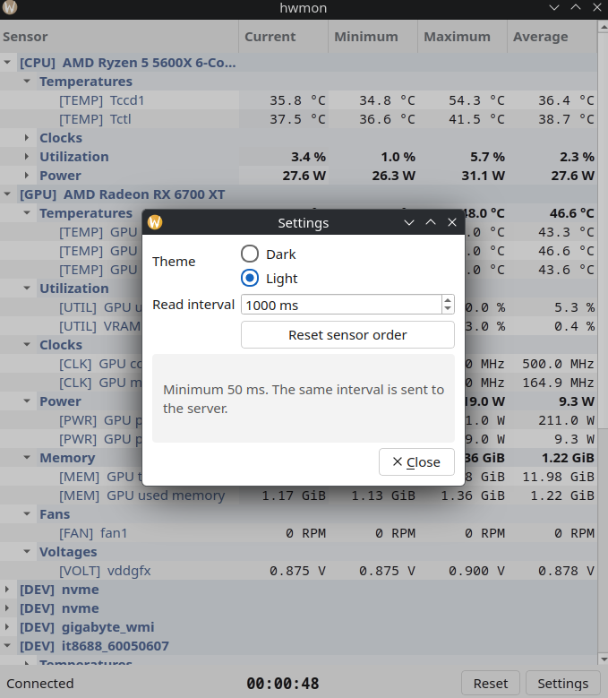

# hwmon client

## Prerequisites

- Linux (tested on Arch Linux)
- g++ or clang++ with c++23 support (tested with g++ version 16.1.0)
  - Libraries:
    - `Qt6` with 'Widgets', 'Network' components
- CMake (tested with version 4.3.2)
- Make (tested with version 4.4.1)

## Features
- display current, minimum, maximum and average value of each sensor
- slight glow on changed value
- freely move devices, sensors (within their sections) in the list
- ability to reset readings
- change logging interval
- dark and light themes

> settings are saved in ~/.config/hwmon directory

<details>
<summary><h2>Client compilation</h2></summary>

Recommended way of compiling client is using provided `build_client.sh` shell script

running it without any arguments will display help message

1. Install dependencies

<details>
  <summary>Arch based</summary>

    sudo pacman -S --needed qt6-base qt6-svg cmake make gcc

</details>

<details>
  <summary>Debian based (Debian, Ubuntu, etc.)</summary>

    sudo apt install qt6-base-dev qt6-svg-dev cmake make gcc

</details>

<details>
  <summary>RHEL based (Red Hat, CentOS, etc.)</summary>

    sudo dnf install qt6-qtbase-devel qt6-qtsvg-devel cmake make gcc gcc-c++

</details>

2. clone the repository

```bash
git clone https://github.com/hfghwpgg/hwmon.git
```

3. navigate to the project directory

```bash
cd hwmon
```

4. run provided shell script to compile the project

```bash
./build_client.sh debug
```

5. the compiled binary will be located in the `build` directory

```bash
./client/build/hwmon-client
```
</details>

<details>
<summary><h2>Screenshots</h2></summary>




</details>
